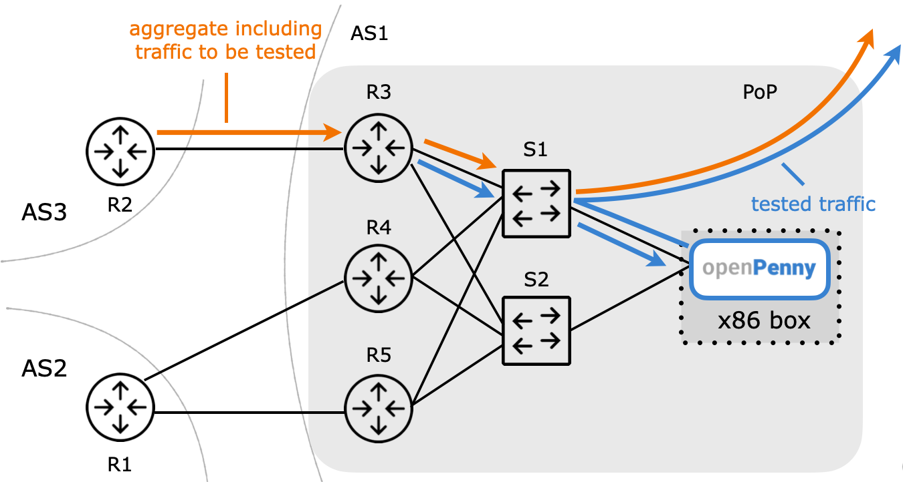

# OpenPenny

[](https://github.com/pgigis/openpenny-testing/actions/workflows/ci.yml)
[](LICENSE)
[](docs/project/CHANGELOG.md)

<p align="center">
  
</p>

OpenPenny tells you whether TCP traffic entering your network is **genuinely
non-spoofed**. It implements the Penny test
([SIGCOMM '24](https://dl.acm.org/doi/10.1145/3651890.3672259)): drop a small
number of packets in a redirected slice of traffic and watch which packets got
retransmitted. Genuine TCP senders retransmit; spoofed sources do not.

The tool supports two modes:

- **Active.** Redirect a slice, drop a few packets, observe retransmissions.
  Confirms if the redirected traffic slice contains closed-loop traffic.
- **Passive.** Mirror traffic only. Track sequence coverage, gaps,
  duplicates, FIN/RST, and idle periods. Useful as a pre-filter before an
  active check.

Capture runs over **AF_XDP** (default) or **DPDK**, with optional forwarding
to a TUN device or raw socket. Interaction through **CLI** (`openpenny_cli`) or
the **gRPC daemon** (`pennyd` + `penny_worker`).

<p align="center">
  
</p>

## Requirements

| Category        | Requirement                                                |
| --------------- | ---------------------------------------------------------- |
| OS / privileges | Linux with root or `CAP_NET_ADMIN`; kernel XDP for AF_XDP. |
| Toolchain       | CMake ≥ 3.16, C++17 compiler, `pkg-config`.                |
| Libraries       | `libbpf`, `libxdp`, `libelf`, `libpcap`, `openssl`.        |
| Optional (DPDK) | `libdpdk` plus hugepages and driver binding.               |
| Optional (gRPC) | `libgrpc++`, `grpc_cpp_plugin`, Protobuf headers, `protoc`.|
| Optional (Py)   | Python 3 with `grpcio` and `grpcio-tools` for samples.     |

## Build

XDP-only CLI:

```bash
cmake -S . -B build -DOPENPENNY_WITH_XDP=ON -DOPENPENNY_WITH_DPDK=OFF
cmake --build build
```

CLI plus gRPC:

```bash
cmake -S . -B build \
  -DOPENPENNY_WITH_XDP=ON \
  -DgRPC_DIR=/path/to/lib/cmake/gRPC \
  -DProtobuf_DIR=/path/to/lib/cmake/protobuf \
  -DGRPC_CPP_PLUGIN=/usr/bin/grpc_cpp_plugin
cmake --build build
```

DPDK:

```bash
cmake -S . -B build -DOPENPENNY_WITH_DPDK=ON -DOPENPENNY_WITH_XDP=OFF
cmake --build build
```

The eBPF program is built automatically; rebuild explicitly with
`cmake --build build --target xdp_bpf`.

## Quick start

CLI, active mode (XDP + TUN):

```bash
sudo ./build/openpenny_cli \
  --config examples/configs/config_default.yaml \
  --mode active \
  --prefix 192.168.41.0/24 \
  --iface <ifname> --queue 0 \
  --tun xdp-tun
```

CLI, passive mode (no forwarding needed; the kernel keeps delivering
packets to the real application):

```bash
sudo ./build/openpenny_cli \
  --config examples/configs/config_default.yaml \
  --mode passive \
  --prefix 192.168.41.0/24 \
  --iface <ifname> --queue 0
```

gRPC daemon:

```bash
./build/pennyd \
  --config examples/configs/config_default.yaml \
  --listen 0.0.0.0:50051 \
  --worker-bin ./build/penny_worker

python3 examples/grpc_client.py \
  --addr localhost:50051 \
  --prefix 192.168.41.0 --mask-bits 24
```

See `examples/grpc_active_example.py` and `examples/grpc_passive_example.py`
for tailored payloads. To forward via a raw socket or AF_PACKET instead of
TUN, set `egress.kind: raw_socket` (or `raw_nic`) in the YAML — see
[configuration examples](docs/run/configuration-examples.md#egress-where-matched-packets-go).

## Architecture (per queue)

```text
                           NIC RX queue
                                │
                                │  (one of:)
─ ─ ─ ─ ─ ─ ─ ─ ─ ─ ─ ─ ─ ─ ─ ─│─ ─ ─ ─ ─ ─ ─ ─ ─ ─ ─ ─ ─  kernel
        ┌───────────────────────┼───────────────────────┐
        ▼                       ▼                       ▼
   ┌─────────┐             ┌─────────┐             ┌─────────┐
   │ AF_XDP  │             │AF_PACKET│             │  DPDK   │
   │redirect │             │  copy   │             │   PMD   │
   └────┬────┘             └────┬────┘             └────┬────┘
─ ─ ─ ─│─ ─ ─ ─ ─ ─ ─ ─ ─ ─ ─ ─│─ ─ ─ ─ ─ ─ ─ ─ ─ ─ ─ ─│─ ─ ─  user
        └───────────────────────┼───────────────────────┘
                                ▼
    ┌───────────────────────────────────────────────────────┐
    │            PacketSource  →  PacketParser              │
    │           (one worker thread per RX queue)            │
    └──────────────────────────┬────────────────────────────┘
                               │
                   ┌───────────┴───────────┐
                   ▼                       ▼
            ┌────────────┐          ┌────────────┐
            │   Active   │          │  Passive   │
            │  pipeline  │          │  pipeline  │
            │ ────────── │          │ ────────── │
            │ drop a few │          │ observe    │
            │ packets;   │          │ gaps and   │
            │ watch for  │          │ coverage;  │
            │ retransmit │          │ no drops   │
            └──────┬─────┘          └─────┬──────┘
                   └───────────┬──────────┘
                               ▼
             ┌─────────────────────────────────────┐
             │   PacketSink  (egress.kind):        │
             │   none, tun, raw_socket, raw_nic    │
             └────────────────┬────────────────────┘
                              ▼
                  Summary  →  CLI / gRPC reply
```

`OpenpennyPipelineDriver` spawns one worker per queue and selects the
ingress backend through `net::create_packet_source`. Each worker owns
its own packet source; egress is a single `PacketSink` shared across
all workers.

## Repository layout

Full map: [`docs/layout.md`](docs/layout.md). High-level:

- `src/`, `include/` — core library, pipelines, CLI, gRPC daemon/worker.
- `src/ingress/` — AF_XDP/eBPF, AF_PACKET mirror, DPDK backends.
- `ebpf/af_xdp/` — eBPF runtime program.
- `proto/` — gRPC service definition.
- `examples/` — configs and sample gRPC clients.
- `tools/traffic_generator/`, `tools/af_xdp/` — test traffic and AF_XDP
  diagnostics.
- `scripts/` — install helpers and utilities.
- `docs/` — start at [`docs/README.md`](docs/README.md).

## References

- RIPE Labs overview and stealthy-hijack case study:
  <https://labs.ripe.net/author/petros_gigis/openpenny-developing-an-open-source-tool-for-detecting-non-spoofed-traffic/>
- SIGCOMM '24 paper: <https://dl.acm.org/doi/10.1145/3651890.3672259>
- NetUK-2 talk: <https://indico.netuk.org/event/2/contributions/37/>

## Project

- Repository: <https://github.com/pgigis/openpenny-testing>
- Contributing: see [`.github/pull_request_template.md`](.github/pull_request_template.md);
  use Issues for bugs/features.
- Security: [`docs/project/SECURITY.md`](docs/project/SECURITY.md).
- Third-party licenses: [`docs/project/DEPENDENCIES-LICENSES.md`](docs/project/DEPENDENCIES-LICENSES.md).
- License: [BSD-2-Clause](LICENSE).

Primary author: **Petros Gigis** ([`pgigis`](https://github.com/pgigis)).
Contributors: <https://github.com/pgigis/openpenny-testing/graphs/contributors>.

The Penny mechanism was developed by **Petros Gigis, Mark Handley, and
Stefano Vissicchio**. This project was supported by the
**RIPE NCC Community Projects Fund 2024**
([details](https://www.ripe.net/community/community-initiatives/cpf/previous-funding-recipients/funding-recipients-2024/)).

Provided "as is" without warranty; the authors and funders are not liable
for any damages arising from its use.
